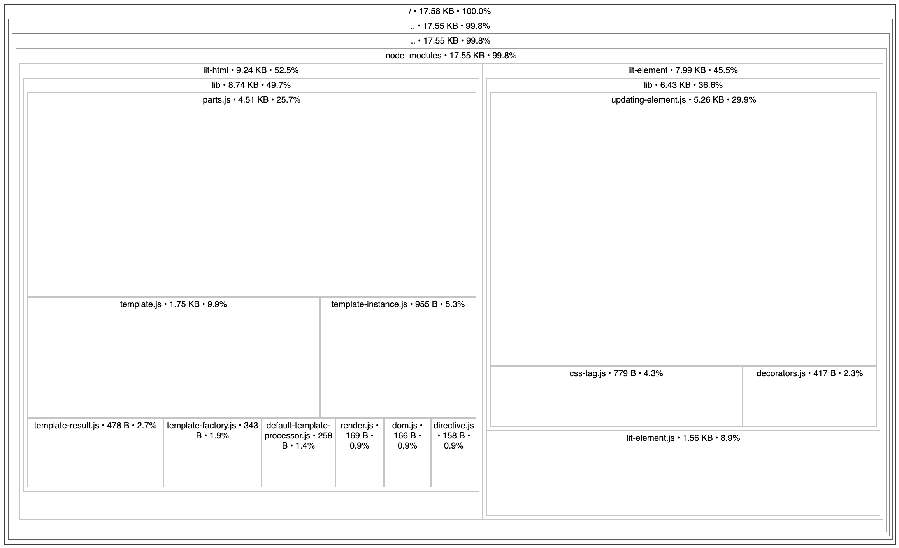
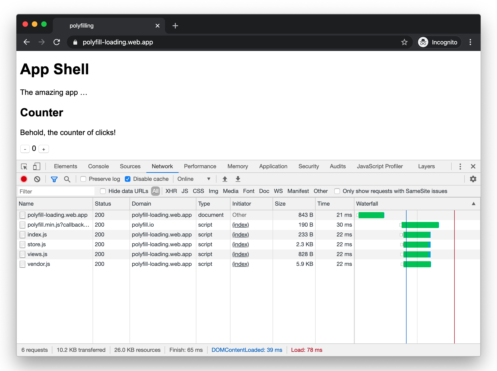
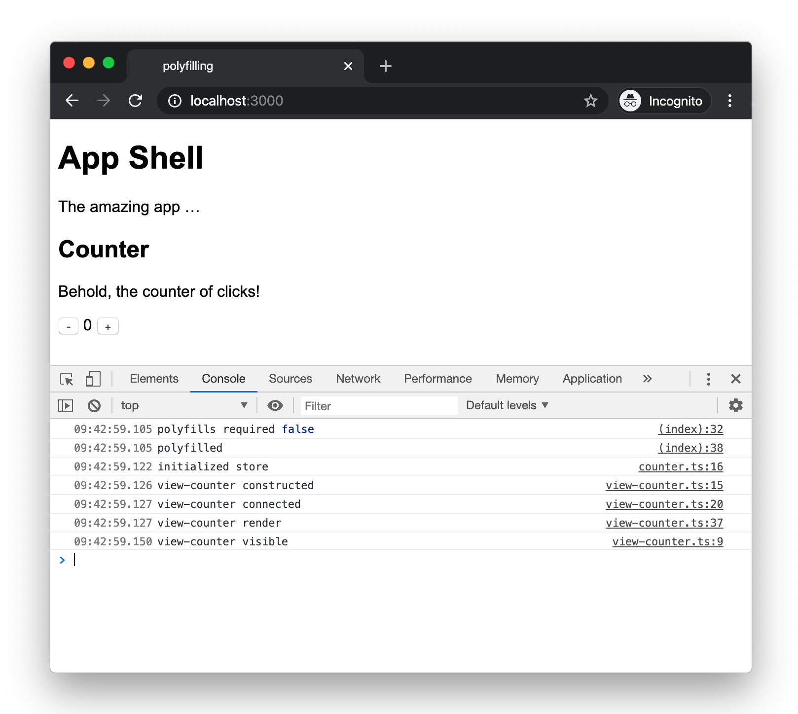
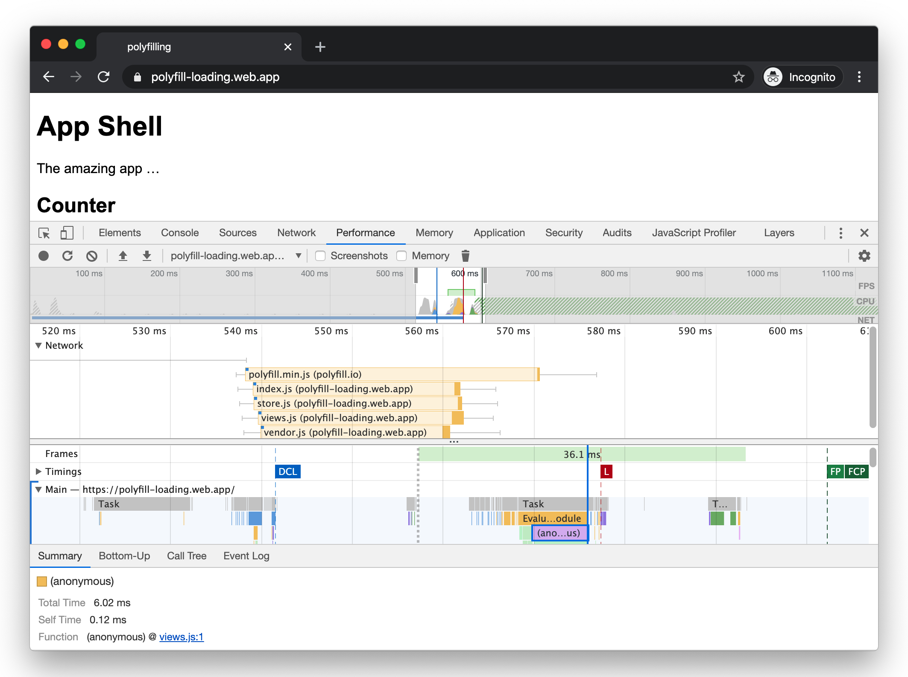
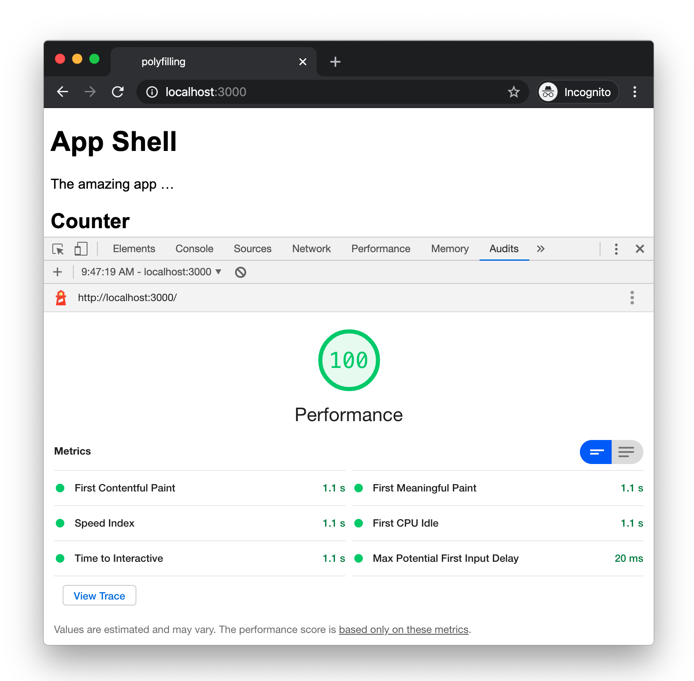
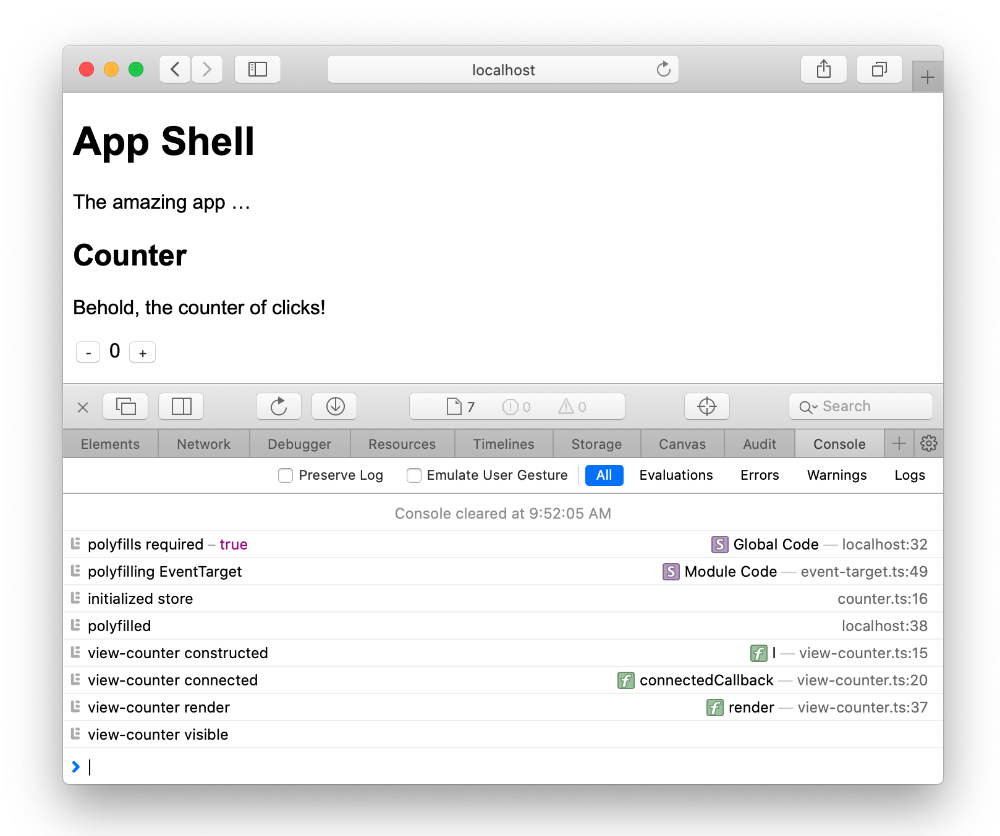
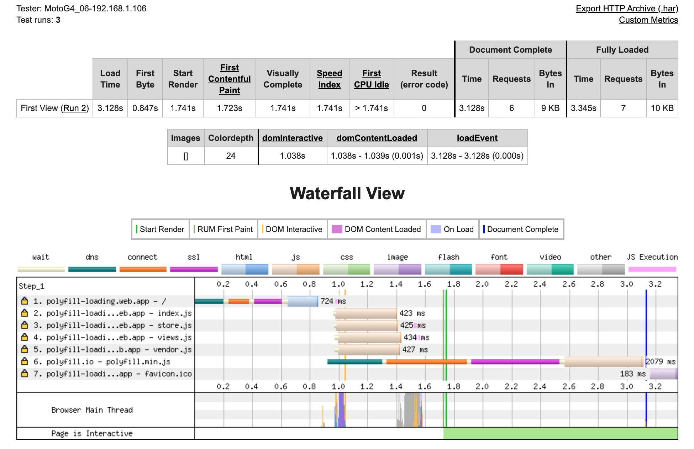
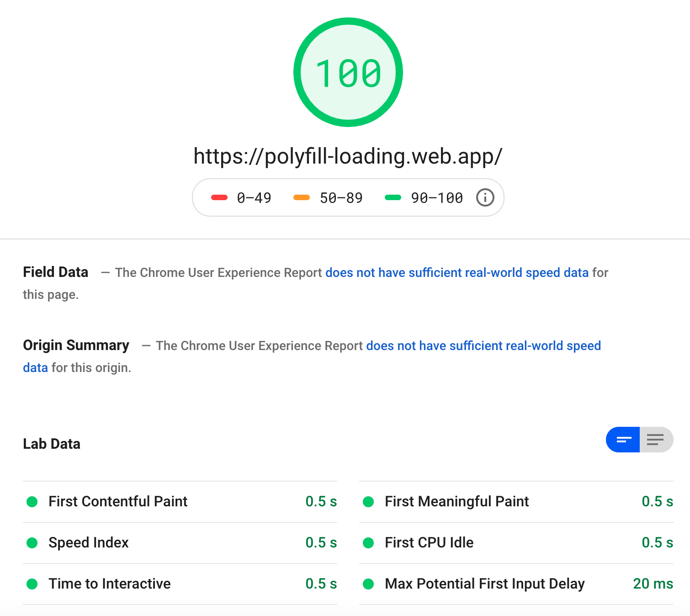

# Eternal Polyfilling of the Legacy Browser

## Fast and Efficient Pollyfill Loading

The modern web platform gains new features all the time which often provide easier, simpler solutions to things that used to require lots of JavaScript to accomplish. Examples are things like `IntersectionObserver` or `ResizeObserver` which remove the hacky approaches needed to decide if a component is in the viewport or if the viewport has been resized.

I'm sure I'm not alone in having a typical development process that goes something like this:

1. Pick up new app feature to implement
1. Explore ways to implement it, discover "new browser feature" that makes it easy with little code
1. Implement app feature and bask in it's glory
1. Try it in something other than Chrome
1. Discover that the cool new feature isn't there
1. Cry a little inside, because it's browser compatibility time again ...

Yes, unfortunately, the 'cool new browser feature' usually doesn't arrive in every browser at the same time. Sometimes it can be months or years before they gain complete support across browser platforms and that definition depends on the browsers that you want your app to support. You may have to support zombie browsers that won't die which are simply never going to get the new feature (looking at you IE!).

So what do you do? Sit waiting and hoping for the day to arrive that you can use the new thing? Fall back on the old ways and just use the implementations built on the old technology? jQuery like it's 2009?

No, the solution is of course to "Polyfill" the browser. That is, to write your app to use the new standard feature and to support old browsers by patching them so it appears that they have support for the feature too. Isn't this just like using the old implementations? Not exactly, because at some point you won't need to support that old browser at all as it's market share dips below some threshold or the ones you _do_ support will gain a native implementation of the new feature. At that point you can remove the polyfill and you don't need to otherwise 'modernize' any of the code because it was built against the new API from the start.

This is how polyfills should work - they should 'evaporate' away as the need for them disappears. You can read more about the reasons for this in [Polyfills and the evolution of the Web](https://www.w3.org/2001/tag/doc/polyfills/) which outlines many best practices to follow.

But how do you actually do it?

Well, reality isn't quite as neat as theory. There are great services such as [polyfill.io](https://polyfill.io/v3/) which can get us some way there by only loading the specific polyfills needed for the browser actually used, which could well be no JavaScript at all if you're using a browser that has native support built in.

Let's imagine we want to make use of the `IntersectionObserver` and `ResizeObserver` features we mentioned at the start. At the time of writing, Chrome has supported both for some time and Chrome users are typically auto-updated so more than likely to be on the latest users - yay for evergreen browsers! MacOS with Safari currently supports Intersection but not Resize, and if an iOS user hasn't updated yet they may support neither on an older Mobile Safari.

We just need to make sure we load the polyfills _before_ our app script loads and executes which will look something like this:

```html
<script src="https://polyfill.io/v3/polyfill.min.js?features=IntersectionObserver,ResizeObserver"></script>
<script src="/scripts/index.js"></script>
```

On Chrome this polyfill request returns an empty JS response (except for a comment):

```js
/* Disable minification (remove `.min` from URL path) for more info */
```

On other browsers, it will load just the polyfill JavaScript necessary to implement whichever features are requested that the browser doesn't support natively.

If you want the 'evaporating polyfills' approach you could decide that this is all you need and stop here.

But the downside is that you are now adding a blocking request for _all_ users, even the ones that don't require any polyfills at all. With a https connection to setup, it could be delaying the app load by a second or more.

This seems unfair to those users, penalizing them for someone else's poor browser choice. Also, as more and more articles make clear, there is a real "need for speed" when it comes to website loading - we still want to have fast load-times as well as good browser support and don't want to sacrifice the former for the latter. The browser may be able to request the app script but it won't be able to load and execute it until the polyfills loading and execution has completed so it won't be as fast as it _could_ be.

I came across this article about [Loading Polyfills Only When Needed](https://philipwalton.com/articles/loading-polyfills-only-when-needed/) which goes into more detail on the problem and offers some solutions but I felt it may be possible to do a better job of allowing the polyfills to load asynchronously without delaying the application loading &amp; startup while retaining the ability to bypass any polyfilling at all for full-featured browsers.

So here is the approach I came up with. I'll try to describe how it works step by step. This particular solution happens to use [Rdx, a tiny state store which is like Redux but smaller](https://github.com/CaptainCodeman/rdx), and some model &amp; routing helpers that go with it but it should translate to most types of app.

The key thing is that we want the parts of our app that _don't_ require any polyfills to be able to start-up and be running rather than delaying the start-pistol until the polyfills are in place.

What we want, ideally, is to be able to load both the app and the polyfills asynchronously and the app wait to use anything that might have been polyfilled until it gets the OK that has been completed. So right away, we will loose something - our applications blindness to polyfills. It will need to know which features _may_ have been polyfilled. Such is the price of performance, but it's not a huge price to pay.

Let's start by adding the `async` attribute to the script elements and also add an additional `callback` parameter to the pollyfill.io URL:

```html
<script async src="https://polyfill.io/v3/polyfill.min.js?callback=polyfilled&features=IntersectionObserver,ResizeObserver"></script>
<script async src="/scripts/index.js" type="module"></script>
```

What this will do is load both scripts asynchronously, executing them in any order - neither is now delaying the other. Whenever the polyfill.io script loads it will try to execute a global function called `polyfilled`, so we need to define that first which can be in an inline script preceeding it:

```html
<script>window.Polyfilled = new Promise(resolve => window.polyfilled = resolve)</script>
<script async src="https://polyfill.io/v3/polyfill.min.js?callback=polyfilled&features=IntersectionObserver,ResizeObserver"></script>
<script async src="/scripts/index.js" type="module"></script>
```

This now gives us a global `Polyfilled` promise that we can use any time we need to delay executing something that may rely on polyfilled features. Remember, that delay may not amount to anything other than a micro-task once the promise is resolved and we'll see later how to make that the fast-default if the browser doesn't need any polyfills at all.

Now the observant among you might now be thinking "erm, Captain ... what if I need to support IE11, which doesn't have Promises - how do I pollyfill _those_ if I need them first to do the polyfilling?!?". Yes, that is a problem. One option would be to embed [the _tiniest_ Promise polyfill you could find](https://github.com/bramstein/promis) into the inline script or another would be to implement a minimal Promise-like object that will allow other code to wait on it using the same `.then(callback)` syntax which would then allow you to load the _full_ Promise polyfill from the service (if other parts of your code require it, which is likely).

Here's a minimal implementation that's hardly much bigger than the Promise setup snippet above and could be inlined in it's place:

```js
window.Polyfilled={r:!1,cbs:[],then(l){this.r?l():this.cbs.push(l)},resolve(){for(var l=0;l<this.cbs.length;l++)this.cbs[l]();this.r=!0}},window.polyfilled=window.Polyfilled.resolve.bind(window.Polyfilled);
```

OK, so we have a callback which will resolve our Promise, all that's left is to decide where in our code we want to "wait" on it.

My personal preference is to use code-splitting so that the app code loads in parallel and it makes it easier for the parts that _don't_ have to wait for anything to be polyfilled to startup sooner. My own experience is that my state-store can startup, handle routing, rehydrating state and all those things and the new features can be awaited in the async middleware. Typically, these polyfilled features _tend_ to be UI related and so that is all that has to be delayed.

I use WebComponents a lot using `lit-element` and `lit-html` so all I do is provide a registration method that will be called to register any components that make use of the polyfilled features. Regular UI components can be included in these or registered up-front so more of the app code can be starting while the polyfill loading is in progress.

It's normally a case of something as simple as this to delay the registration:

```ts
import { registerViews } from './views'

window.Polyfilled.then(registerViews)
```

The `registerViews` method itself is simple:

```ts
import { AppShellElement } from './app-shell'
import { CounterElement } from './view-counter'

export const registerViews = () => {
  customElements.define('app-shell', AppShellElement)
  customElements.define('view-counter', CounterElement)
}
```

An alternative to delaying the registration of all the UI components this way would be to dynamically load the script containing them or to only delay the registration on a component-by-component basis with some registering upfront and only those needing the polyfilled features being delayed. Or, the wait-for-the-polyfills logic could be built into the components themselves - maybe you only need the `IntersectionObserver` in a lazy-image component which could incorporate the promise awaiting internally.

So we've gained the ability to load the polyfills and app asynchronously which buys us some speed. But the majority of our users may not need to load the polyfills at all and as time goes on we'd hope that number will keep going up. So how do we avoid having the delay for the empty polyfill file?

The solution is to incorporate the same guards that gthe polyfill libraries typically use to avoid overwriting the native implementation if one is already available. These are typically simple feature detection checks that test for their existence.

Here is an example of testing for native support for the Intersection and Resize observers to set a `polyfillsRequired` flag. If any of the polyfills _are_ required then the flag is set to true and the Promise is setup to wait for the callback from the polyfill.io library. Remember, we only need to check if _any_ polyfill is needed - the service will handle only sending us those that are actually needed.

The speedup comes where the flag is false when the browser already has a native implementation. In this case the Promise is set to already be resolved which will remove any waiting on the polyfill.io library loading. The polyfill.io library will still be requested, but will just return the almost empty file (actually, it will just check if there is a global `polyfilled` function) but because it's async and we're not waiting on it it won't delay anything in our app and it's simpler and more efficient that introducing any dynamic script loading to just avoid this small request.

```html
<script>
  const polyfillsRequired = !(
    'IntersectionObserver' in window && 
    'IntersectionObserverEntry' in window && 
    'intersectionRatio' in window.IntersectionObserverEntry.prototype &&
    'ResizeObserver' in window
  )

  window.Polyfilled = polyfillsRequired
    ? new Promise(resolve => window.polyfilled = resolve)
    : Promise.resolve()
</script>
```

So what about the results?

Try the [live demo app](https://polyfill-loading.web.app/) yourself.

The code is split into 3 main bundles.

*store* contains the client-side routing, state store, local-storage persistence and Redux dev-tools integration:


*views* contains the lit-element views for the app-shell and counter component:


*vendor* contains the lit-element and lit-html templating libraries:


Here are the network requests showing the polyfill.io file and the three app modules loading (store, vendor and views):


Adding some additional console.logs shows whether the polyfills are required and the timestamps between the events show no delay:


(note, the 'polyfilled' entry just means that it is completed, not that any polyfills were actually loaded - in this case it's a no-op purely to show the timing)

The performance tab also shows the views module being executed nice and early, with no delay caused by the polyfills:


As you'd expect, we get top marks from the lighthouse score:


When the client _does_ require polyfills, the console output shows that they are loaded:


Note that there is also another polyfill in play here, shown by the message "polyfilling EventTarget". In this case, I'm inlining a very small polyfill in the store code (which is still only 2.6Kb gzipped) rather than delay it to load seperately. This is an example where following rigid rules doesn't help and it can make sense to include certain polyfills in the bundle on a case-by-case basis. When I no longer want to support those browsers that need it, I will be able to simply remove the import statement and save ~600 bytes of JavaScript.

WebPageTest results show fast load time and the app code executing before the polyfills have loaded. Using the blocking technique would move the execution of those to after the polyfill script, in this case delaying them by at least 824ms.


Page Speed Insights also shows great results:


## Refs

https://www.webpagetest.org/result/200308_C4_f0cf103bf297033aa703d6491f2e6535/
https://developers.google.com/speed/pagespeed/insights/?url=https%3A%2F%2Fpolyfill-loading.web.app%2F

If you're using a service-worker, the polyfill.io script should be set to cache locally.
